# Divi 5 Tools — User Flow

```mermaid
flowchart TD
    START([Start]) --> Q1{Do you have an\nexisting Divi site\nor export?}

    %% ── Branch A: existing design ──────────────────────────────────────────
    Q1 -->|Yes| A1["/divi5-tools:divi5-extract-style\nhomepage-export.json"]
    A1 --> A2["Outputs:\nClientBrand.tokens.js\nClientBrand.variables.json"]
    A2 --> Q2{Fresh site\nor existing?}
    Q2 -->|Fresh site| A3["Import ClientBrand.variables.json\nDivi Library → Import Global Variables\n\nImport original export\nwith 'Import Presets' checked"]
    Q2 -->|Existing site| A4["Presets already live —\nno import needed"]
    A3 --> GEN
    A4 --> GEN

    %% ── Branch B: brand guide only ─────────────────────────────────────────
    Q1 -->|No — have brand guide| B1["/divi5-tools:divi5-extract-style\n'Primary #1A2744, Accent #F97316,\nfont Space Grotesk…'"]
    B1 --> B2["Outputs:\nBrand_Global-Variables.json"]
    B2 --> B3["Import via\nDivi Library → Import Global Variables"]
    B3 --> GEN

    %% ── Branch C: no design at all ─────────────────────────────────────────
    Q1 -->|No — start from scratch| GEN

    %% ── Generation ─────────────────────────────────────────────────────────
    GEN["/divi5-tools:divi5-page-generator\nbrand · keyword · sections · CTA"]
    GEN --> BRIEF["Stage 1 — Brief\nDetect tokens.js → reuse designer IDs\nSet Design Read + dials"]
    BRIEF --> PREVIEW["Stage 2 — HTML Preview\nBuild preview-brand.html\nTaste pre-flight checklist\nScreenshot → user approves"]
    PREVIEW --> APPROVED{Approved?}
    APPROVED -->|No — iterate| PREVIEW
    APPROVED -->|Yes| BUILD["Stage 3 — Generate + Validate\nWrite generate-brand.js\nRun validator --keyword --meta\nFix all FAILs"]

    %% ── Gate 1: style check ────────────────────────────────────────────────
    BUILD --> Q3{Designer export\npresent?}
    Q3 -->|Yes| STYLECHECK["/divi5-tools:divi5-style-check\noriginal-export.json  new-page.json"]
    STYLECHECK --> SC_RESULT{Result?}
    SC_RESULT -->|INCONSISTENT — FAILs| FIX1["Fix generator script\nRegenerate"]
    FIX1 --> STYLECHECK
    SC_RESULT -->|CONSISTENT ✓\nor WARN-only| IMPORT
    Q3 -->|No| IMPORT

    %% ── Import ─────────────────────────────────────────────────────────────
    IMPORT["/divi5-tools:import-to-local\nbrand-page.json"]
    IMPORT --> LIVE_PREVIEW["Divi renders page\nStage 4 — Playwright screenshot\nCompare live vs HTML mockup"]
    LIVE_PREVIEW --> RENDER_OK{Render matches\nmockup?}
    RENDER_OK -->|No — render bug| FIX2["Fix preset CSS / button enable /\ncache / shortcode token\nRe-import"]
    FIX2 --> LIVE_PREVIEW
    RENDER_OK -->|Yes| PUBLISH["Publish page"]

    %% ── Gate 2: spec compliance ────────────────────────────────────────────
    PUBLISH --> EXPORT_PAGE["Export live page from Divi\nexported-page.json"]
    EXPORT_PAGE --> Q4{Brief or spec\ndocument exists?}
    Q4 -->|Yes| SPECCHECK["/divi5-tools:design-review\nexported-page.json --spec brief.md"]
    SPECCHECK --> SC2_RESULT{Result?}
    SC2_RESULT -->|NON-COMPLIANT — FAILs| FIX3["Fix missing sections / CTAs / copy\nin generator, regenerate + re-import"]
    FIX3 --> SPECCHECK
    SC2_RESULT -->|COMPLIANT ✓| DELIVER
    Q4 -->|No| DELIVER

    %% ── Deliver ────────────────────────────────────────────────────────────
    DELIVER(["✓ Deliver\nbrand-page.json\nbrand-seo-meta.json\nbrand-schema.json"])

    %% ── Styling ────────────────────────────────────────────────────────────
    style STYLECHECK fill:#f0f4ff,stroke:#4a6cf7,color:#000
    style SPECCHECK  fill:#f0f4ff,stroke:#4a6cf7,color:#000
    style SC_RESULT  fill:#fff8e1,stroke:#f59e0b,color:#000
    style SC2_RESULT fill:#fff8e1,stroke:#f59e0b,color:#000
    style FIX1       fill:#fff0f0,stroke:#ef4444,color:#000
    style FIX2       fill:#fff0f0,stroke:#ef4444,color:#000
    style FIX3       fill:#fff0f0,stroke:#ef4444,color:#000
    style DELIVER    fill:#f0fff4,stroke:#22c55e,color:#000
    style START      fill:#1e293b,stroke:#1e293b,color:#fff
```

## Reading the diagram

| Colour | Meaning |
|--------|---------|
| Blue border | QA gate skill — must pass before proceeding |
| Amber | Decision point with pass/fail outcome |
| Red | Fix loop — return to previous step |
| Green | Delivery — all gates passed |

## Gate summary

| Gate | Skill | When required | Blocks on |
|------|-------|---------------|-----------|
| **Gate 1** — Style consistency | `/divi5-style-check` | Designer export present | FAIL: new preset IDs or off-palette colours |
| **Gate 2** — Spec compliance | `/design-review --spec` | Brief/spec document exists | FAIL: missing sections, wrong CTAs, absent content |

Both gates are required when their inputs are present. Skipping Gate 1 risks importing a page that silently diverges from the site design system. Skipping Gate 2 risks delivering a page that doesn't match the agreed brief.
